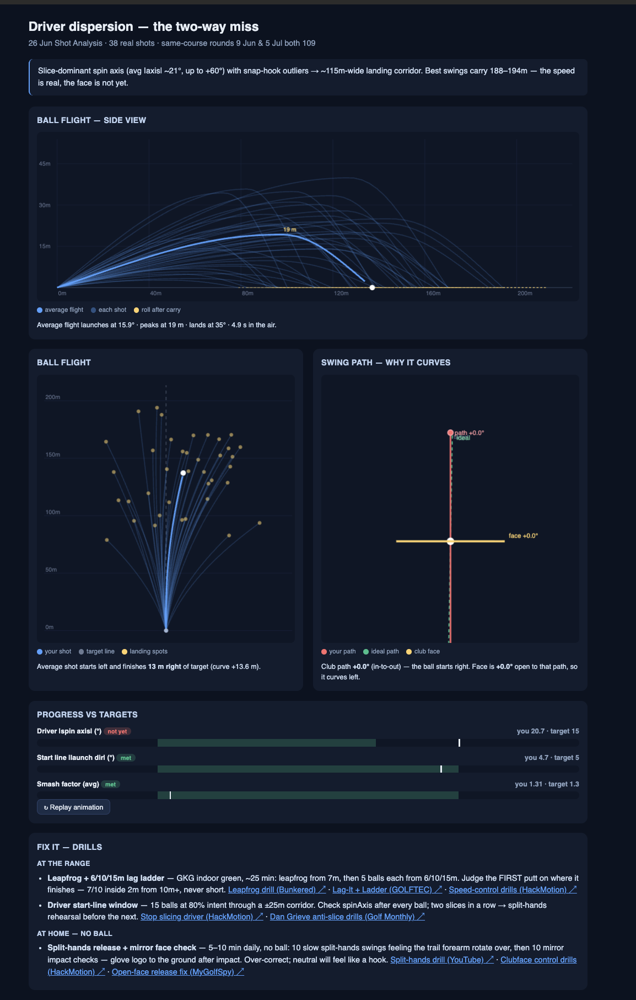

<!-- mcp-name: io.github.bjornj12/golf-coach -->

# Golf Coach

**A golf coach that trains you purely on your stats — round after round, closer to scratch.**

Golf Coach logs into **Trackman Golf** with your own account and turns your
stats — course rounds, practice sessions, shot-level launch-monitor data, club
gapping, and handicap — into a diagnosis of where you're losing strokes, then
hands you a specific practice plan with drills and YouTube links for your next
session and grades your progress over time. It ships as an MCP server (the data
tools) plus Claude **skills** (the coaching brain).

## What you get

You don't read the charts — you get a coach. Point it at your Trackman data and it:

- **Finds where you're actually losing strokes** — not "work on your irons," but
  *"your driver has a two-way miss spreading landings across a ~115 m corridor —
  the speed is real, the face isn't yet."*
- **Hands you one specific session** — clubs, distances, reps, a Trackman target,
  and a drill with a real YouTube link. Stuck indoors? It has an at-home, no-ball
  routine too.
- **Grades your progress** — it saves the plan and checks your next session
  against it, so you actually know whether it worked.
- **Shows you the picture** — an animated view of your ball flight, the swing
  path behind the miss, and how close you are to each target.



*A real session diagnosis: what's wrong, why, how close you are to your targets, and exactly what to practice next.*

> **Name note.** "Golf Coach" is the product name. The technical ids stay
> `golf-coach` (MCP server / plugin) and `golf-coach` (the published
> package), so existing installs keep working.

> [!IMPORTANT]
> **Unofficial.** This project is not affiliated with or endorsed by Trackman.
> It talks to Trackman's **private** web API using a token from *your own*
> authenticated session, and automates a browser login on your behalf. This may
> conflict with Trackman's Terms of Service — use it on your own account, at your
> own risk. Never use it to access anyone else's data.

## Design boundary

- **MCP server** = raw data fetch + auth only. No opinions.
- **Skills** = all the coaching (analysis, plans, drills).

See [`CLAUDE.md`](./CLAUDE.md) for the full architecture and auth/secret rules.

## Install

Pick the path for how you use Claude. Each takes about two minutes, then do the
one-time [Authentication](#authentication-one-time) step.

### 🖥️ Claude Desktop — one-click (recommended, no terminal)

1. **Download [`golf-coach.mcpb`](https://github.com/bjornj12/golf-coach/releases/latest/download/golf-coach.mcpb)** (from the [latest release](https://github.com/bjornj12/golf-coach/releases/latest)).
2. Open **Claude Desktop → Settings → Extensions**, drag the file in (or
   double-click it), and click **Install**. Leave the token field **blank**.
3. In a chat, say **"log in to Trackman"** → a **browser window opens** → sign in
   once with your Trackman email + password (Apple / Google sign-in works too).
   The window **stays open until you finish** — take your time, it won't close on
   its own. When you're done, tell Claude and it confirms you're signed in.
4. Ask Claude: *"What's my Trackman handicap?"*

Nothing to install and no config to edit — Claude Desktop runs everything and
opens the sign-in browser for you. (First sign-in may take a moment if it needs
to fetch a browser. You may also see an "unsigned extension" note — expected for
one installed from a file.)

**Platforms:** macOS, Linux, and **Windows** — Claude Desktop runs the server via
`uv` on all three, and the browser sign-in uses Playwright (cross-platform). One
caveat on Windows: the local token/data files are protected by your Windows user
profile (ACLs) rather than POSIX `0600` modes. The optional cron/launchd
auto-refresh script is macOS/Linux only — on Windows use Task Scheduler, or just
re-run the in-app "log in to Trackman" when the ~7-day token lapses.

### ⌨️ Claude Code — plugin (server **and** coaching skills)

```text
/plugin marketplace add bjornj12/golf-coach
/plugin install golf-coach@golf-coach
```

Installs the MCP server (run via `uvx`) and all seven coaching skills.

### 🔌 Other MCP clients (or Claude Desktop without the extension)

Requires [uv](https://docs.astral.sh/uv/) (`curl -LsSf https://astral.sh/uv/install.sh | sh`).
Add this to your client's MCP config:

```json
{
  "mcpServers": {
    "golf-coach": { "command": "uvx", "args": ["golf-coach"] }
  }
}
```

> For **Claude Desktop's manual config** (`~/Library/Application Support/Claude/claude_desktop_config.json`
> on macOS), use the **absolute path** to `uvx` — e.g. `/opt/homebrew/bin/uvx` —
> because the app doesn't inherit your shell `PATH`. The `.mcpb` install above
> avoids this entirely.

## Authentication (one-time)

The server needs to sign in to **your** Trackman account. Trackman has no public
login API, so it captures a token from a real signed-in browser session once;
it's then cached locally and refreshes itself. Your password is never seen or
stored by the tool, and nothing leaves your machine.

### Easiest — just ask Claude to log in (Claude Desktop / Claude Code)

Say **"log in to Trackman."** A browser window opens (an isolated profile, not
your normal Chrome); sign in once, at your own pace — the window is driven by a
background task, so it **stays open until you're done** and won't be closed out
from under you (even a slow Apple/Google 2FA is fine). When you've finished,
tell Claude and it confirms. The token caches at `~/.golf-coach/token.json`
(mode `0600`) and the MCP uses it automatically from then on. No terminal, no
token to copy — the extension fetches a browser itself if you don't have one.

### Terminal alternative (CLI users)

```bash
uv tool install "golf-coach[login]"
golf-coach login              # opens a browser; sign in once
golf-coach login --headless   # silent refresh later (tokens last ~7 days)
scripts/install-refresh-schedule.sh   # optional: auto-refresh twice weekly
```

### Advanced — paste a token

`portal.trackmangolf.com` → DevTools → **Network** → a `graphql` request → copy
the `Authorization: Bearer …` value → paste into the extension's **Trackman
token** field (or set `TRACKMAN_TOKEN`). Tokens expire after ~7 days, so the
sign-in flows above are easier.

### Verify it worked

Ask Claude *"Am I signed in to Trackman?"* — it runs `auth(action="status")` and
replies with your name (never the token).

## MCP tools

All tools return **raw data only**; the skills interpret it.

**8 tools.** `trackman` and `gamebook` each take an `action` (so the agent
picks one tool with a mode rather than many near-identical tools).

**Setup:** `setup` — one call returns an always-on coach **system prompt** (for a
Project), the **skills** as upload-ready files, and per-client steps. There's a
matching `setup` prompt in the picker.

**Auth:** `auth(action: status | login, source?)`

**Trackman data (read-only):** `trackman(action: profile | handicap | sessions
| session | rounds | clubs | summary)` — profile+handicap, handicap history,
activity list, one activity in full (incl. shot-level metrics), course rounds,
club gapping, activity counts.

**Gamebook rounds (local, deterministic):** `gamebook(action: save | list |
get | compare)` — on-course rounds ingested from Golf GameBook screenshots,
rolling last 5, coverage-aware (only score-per-hole is trusted).

**Cross-source synthesis (local, deterministic):** `synthesize()` — aligns
Trackman's and GameBook's per-source Findings by skill area (no verdict; see
`CLAUDE.md`'s "Sources & normalization").

**Session analysis (local, deterministic):** `session_analysis(action: analyze | get | list)`

**Training-plan memory:** `training_plan(action: save | next | list | done | verify)`

**Visualization:** `build_visualization` (self-contained animated HTML artifact)

See [`CLAUDE.md`](./CLAUDE.md) for the full table and backing GraphQL.

## Skills (coaching brain)

The skills under [`skills/`](./skills) are delivered two ways:

- **Claude Code:** installed automatically with the plugin.
- **Any MCP client (incl. Claude Desktop):** the server **serves them as MCP
  prompts**, so they show up in your client's prompt picker — no separate install.

| Skill | What it does |
|-------|--------------|
| `trackman-stats-analysis` | Diagnose weaknesses from the data |
| `golf-coaching` | Turn the diagnosis into an actionable practice plan (visual-first; auto-grades progress) |
| `drill-library` | Curated drills + vetted links — incl. **at-home / no-ball** drills — plus live search |
| `golf-practice-at-home` | Build a daily **no-ball** routine for a diagnosed fault, animated per drill |
| `trackman-session-analyzer` | Ingest + normalize recent sessions |
| `gamebook-screenshot-analysis` | Ingest GameBook round screenshots into a coverage-aware round record; scoring-led progress that feeds the coach |
| `trackman-visualizer` | Animate a diagnosis (or a single drill's mechanics) as an HTML artifact |

(`trackman-api-discovery` is a project/dev skill and isn't served as a prompt.)

## Development

```bash
uv venv && uv pip install -e '.[login,dev]'   # [login] = Playwright, [dev] = test/lint tools

golf-coach                       # run the MCP server (stdio)
uv run python scripts/validate.py  # sanity-check stats coverage with your token

uv run pytest        # tests
uv run ruff check    # lint
uv run mypy          # type-check
```

Releasing (PyPI + MCP Registry + the Desktop `.mcpb`) is one command —
`scripts/release.sh patch` — see [`PUBLISHING.md`](./PUBLISHING.md).

## License

[MIT](./LICENSE)
